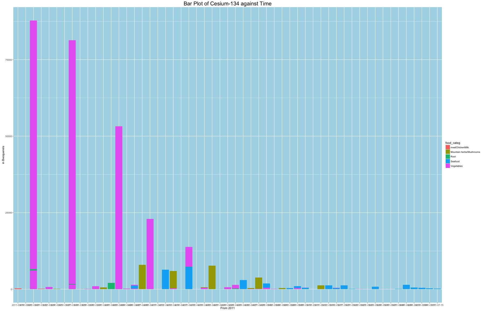

Trend of Fukushima Daichi Radiations in Eatables 
========================================================
author: Ntabgoba Jovani
date: 08th/July/2016
autosize: true
Introduction to Fukushima Radiations
========================================================
Visualizing the trend of Radiations that resulted from the 2011 Tsunami damage of a Nuclear Plant in Fukushima Japan.
The major contaminants were isotopes of  __Iodine-131__ (8 day half-life), Tellurium-132 (3 day half-life), __Cesium-134__ (2 year half-life), and __Cesium-137__ (30 year half-life). 

__List of Food Items whose Radiations are monintored__
- Staple Food (that is Meat,Chicken and Milk)
- Water (tap water)
- Fish (fished along the Japan's east coast)
- Rice (harvested)
- Birds and Animals

Cleaning the Datasets
========================================================

```r
# WATER
water1 <- read_csv("Fukushima_DrinkingWater_2011-14.csv", na = "ND")
# select important features
water <- select(water1, c(1, 9, 10, 11, 12, 14, 16))
# rename the columns with easily machine readable names
colnames(water) <- c("date", "lat", "lng", "daichi_distance", "Iodine_131", 
    "Cesium_134", "Cesium_137")
ggplot(data = water, mapping = aes(x = date, y = Iodine_131, na.rm = TRUE)) + 
    geom_point(shape = 16)
# Write a new clean dataset of water
write_csv(water1, path = "water2.csv")
# Food,Fish, Rice and Birds&Animals datasets are also cleaned in similar way
```

Visualization Cesium_134 in Staple Foods
========================================================


3D Visualizations of Cesium-134,Cesium-137 &date 
========================================================

```r
food2 <- read.csv("food2.csv")
require(plotly)
plot_ly(data = food2, z = log(Cesium_134), x = date, y = log(Cesium_137), type ="scatter3d",color=food_categ, mode = "markers")%>%
        layout(title="3D Plot of 2 Isotopes against Time")
```
 


